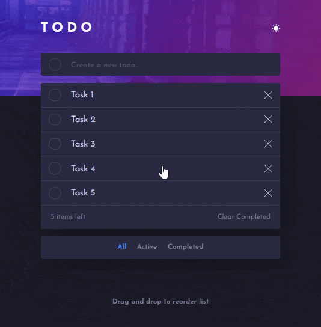

# Frontend Mentor - Todo app solution

This is a solution to the [Todo app challenge on Frontend Mentor](https://www.frontendmentor.io/challenges/todo-app-Su1_KokOW).

## Table of contents

- [Overview](#overview)
  - [The challenge](#the-challenge)
  - [Screenshot](#screenshot)
  - [Links](#links)
- [Built with](#built-with)
- [Author](#author)

## Overview

### The challenge

Users should be able to:

- Add new todos to the list
- Mark todos as complete
- Delete todos from the list
- Filter by all/active/complete todos
- Clear all completed todos
- Toggle light and dark mode
- View the optimal layout for the app depending on their device's screen size
- See hover states for all interactive elements on the page
- Drag and drop to reorder items on the list

### Screenshot

### Links

- Solution URL: [Code on GitHub](https://github.com/DmitryMuzalev/todo-app)
- Live Site URL: [Live on GitHub Pages](https://dmitrymuzalev.github.io/todo-app/)

## Built with

- React 18
- Flexbox
- SCSS

## Author

- Github - [DmitryMuzalev](https://github.com/DmitryMuzalev)
